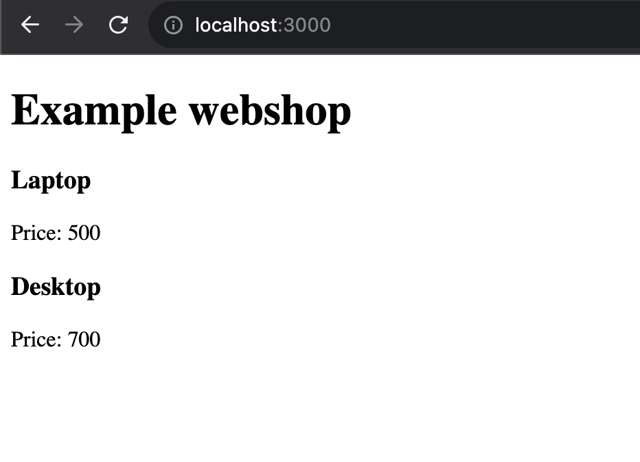

## Week 14 Quiz - Debugging, Git, & GitHub

You have just joined your favorite company and have been tasked with printing new data to a webpage. However, the existing files/directories are all jumbled up, and the code seems to have errors. Fix the bugs and sile structure. 

1. Debug the broken code so that it's working
2. Correct the file architecture using command line
3. node_modules are committed, remove them from repo on GitHub
4. Correct the server file’s directory by moving it to the appropriate directory
5. Update README with
    - screenshot of the app's webpage, 
    - document errors you encountered and how you fixed them, 
    - detail the git commands you used to remove the node_modules, and
    - detail the git commands you used to correct the file structure

 

* remove current git
`rm -fr .git`

* Server folder is moved to the root level:
`mv /Users/tpl622_8/Desktop/Week14_Quiz1/client/server /Users/tpl622_8/Desktop/Week14_Quiz1`

* node_modules are placed in .gitignore and to delete from a repo:
`git rm -r --cached node_modules`

* go to server folder to run:
`npm run dev`

